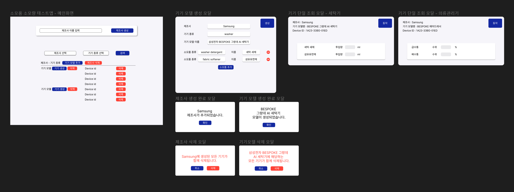
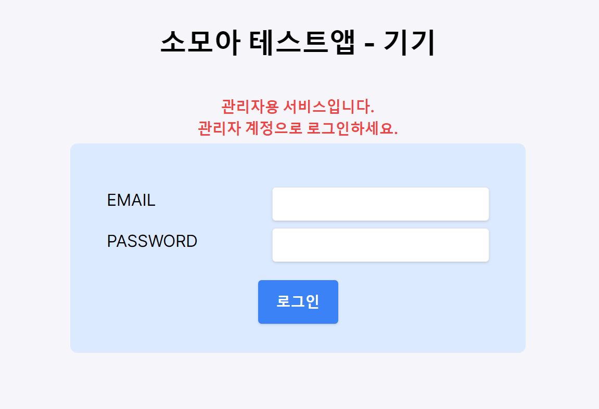
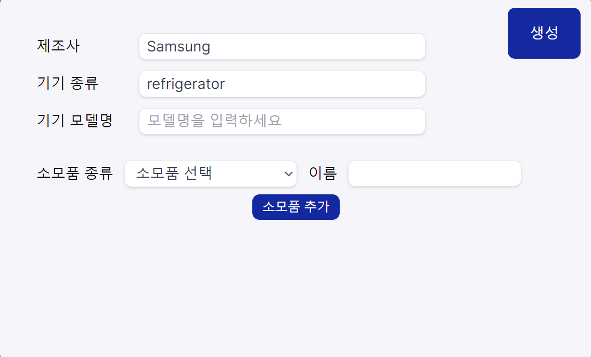
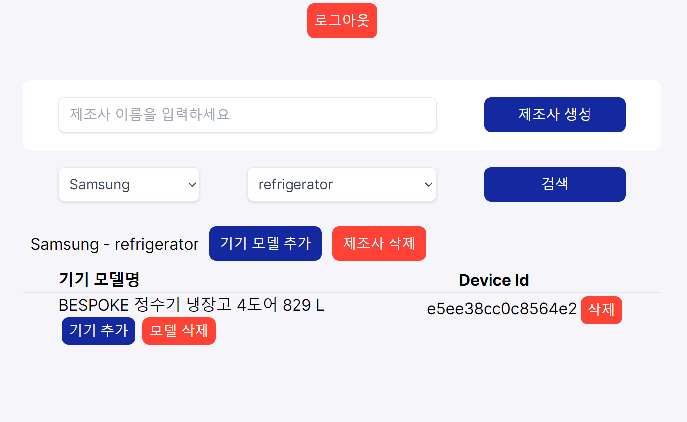
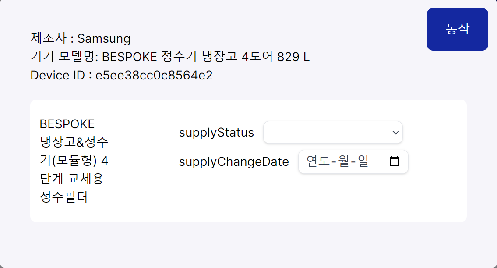
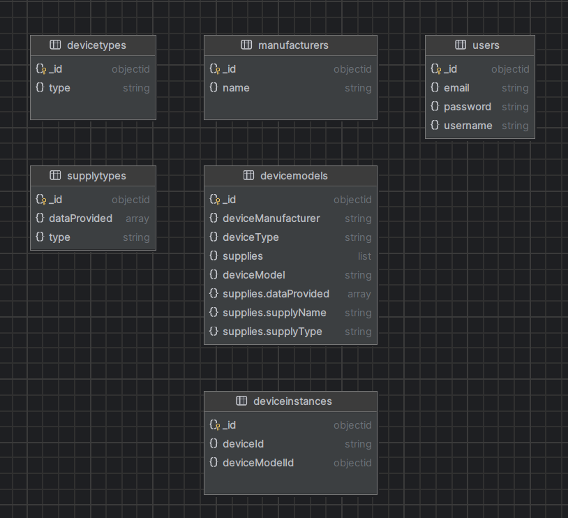
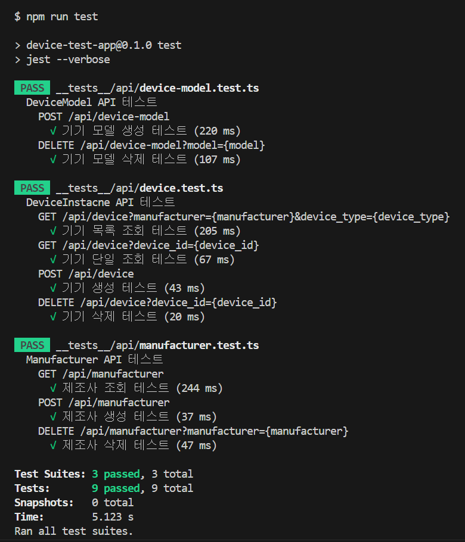

 
    
    <h2>소모아 기기 테스트 앱</h2>
    
소모아 기기 테스트 앱은 메인 서비스인 소모아와 연결할 IoT 가전기기를 대체하는 웹 사이트입니다.

    
관리자가 소모아 플랫폼에 연결할 다양한 IoT 기기들을 손쉽게 테스트하고 시뮬레이션할 수 있게 해줍니다.

 

# 기술 스택

-   Frontend

    |                           Next.js                            |                           Tailwind CSS                            |                         Zustand                         |
    | :----------------------------------------------------------: | :---------------------------------------------------------------: | :-----------------------------------------------------: |
    |  |  |  |

-   Backend

    |                           Next.js                            |                         NextAuth                         |                         MongoDB                         |                         ts-jest                         |
    | :----------------------------------------------------------: | :------------------------------------------------------: | :-----------------------------------------------------: | :-----------------------------------------------------: |
    |  |  |  |  |

# 기능

-   **제조사 생성**: 사용자는 다양한 IoT 기기 제조사를 생성할 수 있습니다.
-   **모델 생성**: 특정 제조사의 기기 모델을 생성할 수 있습니다.
-   **기기 생성**: 실제 기기와 같은 가상의 기기를 생성할 수 있습니다.
-   **기기 동작**: 생성한 가상 기기를 실제와 같이 동작시킬 수 있습니다.

# 화면설계

# 화면

### 로그인

### 기기 모델 생성

### 기기 생성

### 기기 동작

# ERD

# API

## 기기

| 권한  | Method                                                                          | URI                                                               | 설명           | 우선순위                                                                        |
| ----- | ------------------------------------------------------------------------------- | ----------------------------------------------------------------- | -------------- | ------------------------------------------------------------------------------- |
| Admin |  | /api/device                                                       | 기기 생성      |  |
| Admin |   | /api/device?manufacturer={manufacturer}&device_type={device_type} | 기기 모델 조회 |  |
| All   |   | /api/device?device_id={device_id}                                 | 기기 단일 조회 |  |

## 기기 모델

| 권한  | Method                                                                            | URI                               | 설명           | 우선순위                                                                        |
| ----- | --------------------------------------------------------------------------------- | --------------------------------- | -------------- | ------------------------------------------------------------------------------- |
| Admin |  | /api/device?device_id={device_id} | 기기 삭제      |   |
| Admin |    | /api/device-model                 | 기기 모델 생성 |  |
| Admin |  | /api/device-model?model={model}   | 기기 모델 삭제 |   |

## 제조사

| 권한  | Method                                                                            | URI                                           | 설명             | 우선순위                                                                          |
| ----- | --------------------------------------------------------------------------------- | --------------------------------------------- | ---------------- | --------------------------------------------------------------------------------- |
| Admin |    | /api/manufacturer                             | 제조사 생성      |  |
| Admin |     | /api/manufacturer                             | 제조사 목록 조회 |    |
| Admin |  | /api/manufacturer?manufacturer={manufacturer} | 제조사 삭제      |     |

# API 테스트

